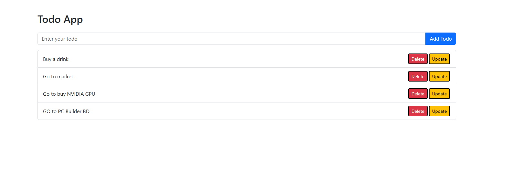

# 📝 Todo App

A basic Todo application built using **HTML**, **CSS (Bootstrap)**, and **Vanilla JavaScript**. This app allows users to add, delete, and view todos dynamically.

---

## 🚀 Features

- Add new todos
- Delete existing todos
- Render todos dynamically
- Update todos 

---

## 📸 Screenshot

---

## 📂 Folder Structure
